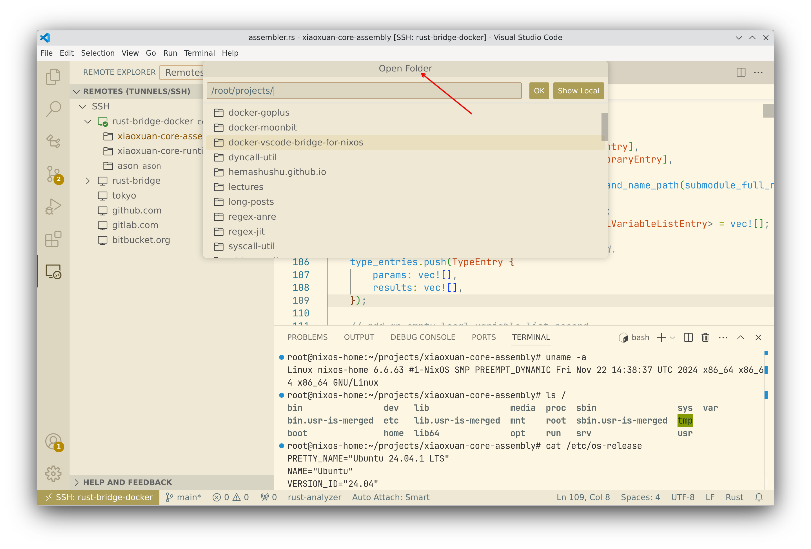

# VSCode Bridge for NixOS

This image is designed to enable development, debugging, and extensions with VSCode running on [the NixOS operating system](https://nixos.org/) just like it running on a general Linux operating system.

<!-- @import "[TOC]" {cmd="toc" depthFrom=2 depthTo=4 orderedList=false} -->

<!-- code_chunk_output -->

- [Motivation](#motivation)
- [Quick start](#quick-start)
- [Installed packages](#installed-packages)
- [Rebuilding the image](#rebuilding-the-image)
- [Repository](#repository)

<!-- /code_chunk_output -->

## Motivation

You may encounter some problems when debugging Rust (or C/C++) programs on the NixOS operating system, such as the following complaintion from `CodeLLDB` when debugging Rust programs:

```text
Could not start dynamically linked executable: ~/.vscode/extensions/vadimcn.vscode-lldb-1.11.1/adapter/codelldb
NixOS cannot run dynamically linked executables intended for generic linux environments out of the box. For more information, see: https://nix.dev/permalink/stub-ld
```

This is because the NixOS does not have the same [Filesystem Hierarchy Structure (FHS)](https://refspecs.linuxfoundation.org/FHS_3.0/fhs/index.html) as a general Linux operating system, causing some VSCode extensions with pre-compiled programs to fail to run. There are many solutions to this problem, for example:

1. Using another version of VSCode [vscode.fhs](https://nixos.wiki/wiki/Visual_Studio_Code), which creates a standard FHS and then enters the `chroot` environment. This method is very simple but not always work.

2. Using [VSCode Dev Containers](https://code.visualstudio.com/docs/devcontainers/containers), which creates a Docker container (a standard Linux environment) for each project, and then runs [vscode-server](https://code.visualstudio.com/docs/remote/vscode-server) inside the container, and maps the project source files into the container. The program's running, debugging, and extension running are all done within this container.

3. Manually creating a virtual machine (such as KVM or VirtualBox), installing a complete Linux operating system, sharing the host's project source files with the guest, mounting the shared files in the guest and finally connecting to the guest using VSCode's Remote SSH feature. The remaining steps are similar to method 2 above.

However, it is more convenient to create and maintain a dedicated Docker container manually, configure the Rust (and C/C++ etc.) development environment in the container, start the `sshd` service, and then connect to the container using VSCode's Remote SSH feature.

This method is actually similar to method 2 above, but because this Docker container is craeted by ourselves, it is more flexible (for example, you can install libraries and packages you need), and it can be shared by multiple projects. In addition, it has much higher performance then method 3, because a container is just a specical process running in a [Namespace](https://en.wikipedia.org/wiki/Linux_namespaces), which is much efficient than running a complete virtual machine and operating system. Therefore, this method can be considered a combination of the advantages of method 2 and 3.

## Quick start

1. Pull the image using Podman/Docker:

```bash
docker pull hemashushu/vscode-bridge-for-nixos:2.0.0
```

> Note: I used [podman](https://podman.io/) instead of Docker in NixOS, but because the commands are the same, I still write the commands in the following examples as "docker".

2. Run this container

```bash
docker run \
  -it \
  --rm \
  --mount type=bind,source="/home/yang/projects",target="/root/projects" \
  --mount type=bind,source="/home/yang/bridge.ssh",target="/root/.ssh" \
  --mount type=bind,source="/home/yang/bridge.vscode-server",target="/root/.vscode-server" \
  --mount type=bind,source="/home/yang/bridge.cargo",target="/root/.cargo" \
  --name vscode-bridge \
  --network host \
  --cap-add=NET_RAW \
  vscode-bridge-for-nixos:2.0.0
```

In the command, several folders in the container are mapped to the host's file system (these folders on the host should be created manally):

- `projects` is the folder where you store your project source files. Change it to the one you usually use.
- `.ssh` is used to store the host's SSH public key to simplify the connection.
- `.vscode-server` is used to store VSCode Server configuration and extensions.
- `.cargo` is the cache for Rust libraries. You don't need to map this folder if you are not engage Rust development.

3. Connect to the container

First, connect to the container by SSH (the default password for the root user is `123456`):

`ssh -p 3322 root@localhost`

If there is no problem, you can copy the host's SSH public key to the container to simplify the subsequent connection:

`ssh-copy-id -p 3322 root@localhost`

4. Connect to the container with VSCode Remote SSH

Install the "Remote - SSH", "Remote - SSH: Editing Configuration Files
" and "Remote Explorer" extensions in VSCode, then press "Ctrl+Shift+P" to popup the command palette, select "Remote-SSH: Connect to host...", and then follow the prompts to connect to the container you just ran and select "Open Folder" to open your project folder.



Finally install extensions in the "Extensions" of VSCode according to your needs (some extensions must run on the remote, such as the `rust-analyzer`, so installing it locally in VSCode will not work).

> During development, the container must remain running.

5. Stop the container

When you have finished development and debugging, you can execute command `docker stop vscode-bridge` to terminate the container.

## Installed packages

- GCC, LLVM, CMake
- Vim, Git, SSH
- Rust, Go, Nodejs, Python, JDK

## Rebuilding the image

You can rebuild this image locally using the command:

`docker build -t vscode-bridge-for-nixos:2.0.0 .`

## Repository

- https://hub.docker.com/r/hemashushu/docker-vscode-bridge-for-nixos
- https://github.com/hemashushu/docker-vscode-bridge-for-nixos
